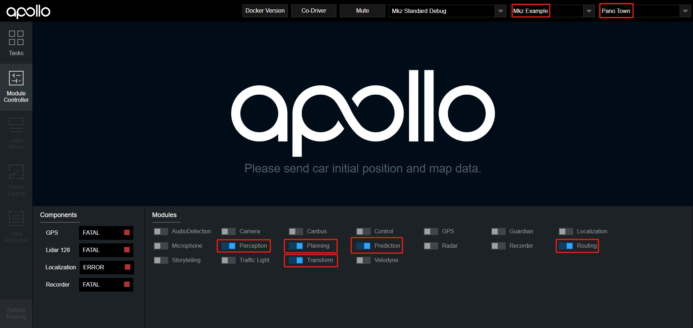
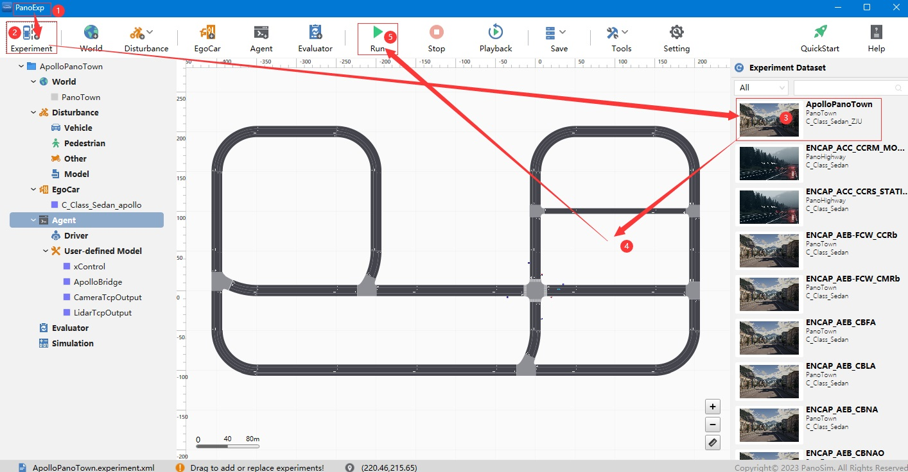
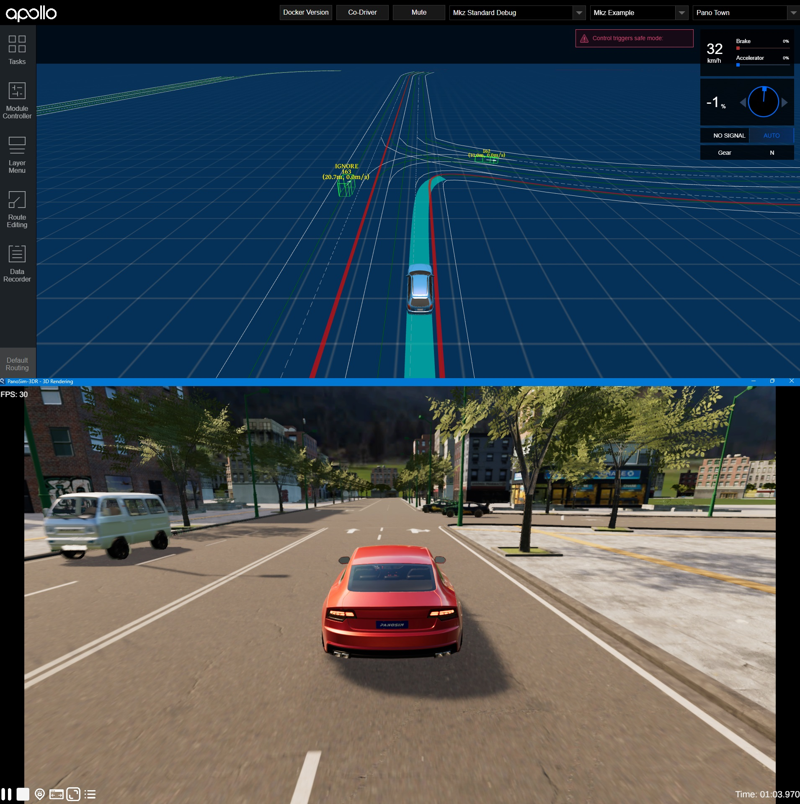

<a name="readme-top"></a>

<!-- PROJECT LOGO -->
<br />
<div align="center">
  <!-- <a href="https://github.com/othneildrew/Best-README-Template">
    
  </a> -->

  <h1 align="center">PanoSim Apollo Bridge</h1>
  <p align="center">
    <b>PanoSim & Apollo Co-simulation</b>
    <!-- <br /> -->
    <!-- <a href="https://github.com/othneildrew/Best-README-Template"><strong>Explore the docs »</strong></a>
    <br /> -->
    <br />
    <a href="https://github.com/liyanlee/PanoSim_Apollo_Bridge">View Demo</a>
    ·
    <a href="https://github.com/liyanlee/PanoSim_Apollo_Bridge/issues">Report Bug</a>
    ·
    <a href="https://github.com/liyanlee/PanoSim_Apollo_Bridge/pulls">Request Feature</a>
    <br>
  </p>
</div>


[](https://www.tickgit.com/browse?repo=github.com/liyanlee/PanoSim_Apollo_Bridge)


[](https://github.com/liyanlee/PanoSim_Apollo_Bridge/blob/main/LICENSE)


<!-- ABOUT THE PROJECT -->
## About
This project aims to provide a data and control bridge for the communication between [__PanoSim__](http://www.panosim.com/) and [__Apollo__](https://www.apollo.auto/). It was tested with PanoSim **v32** and the [Apollo v7.0.0](https://github.com/ApolloAuto/apollo/tree/v7.0.0)

## Quick Start

### (1) Network Environment
- apollo IP Address: **192.168.2.23**
- PanoSim IP Address: **192.168.2.33**

If the IP Addresses are different, you need to modify the Apollo bridge script(.py) and PanoSim configuration at the same time.

### (2) Deployment PanoSim
1. [user manual](https://aic3a8owje.feishu.cn/docs/doccncuZRYgxSjNtBxTU2PXDXNF)
2. plugins


### (3) Deployment Apollo

1. [install prerequisite](https://github.com/ApolloAuto/apollo/blob/v7.0.0/docs/specs/prerequisite_software_installation_guide.md)


2. [install](https://github.com/ApolloAuto/apollo/blob/v7.0.0/docs/quickstart/apollo_software_installation_guide.md)


3. copy bridge

    copy(upload) the bridge [folder](https://github.com/liyanlee/PanoSim_Apollo_Bridge/tree/main/apollo/bridge) into apollo
    ```
    apollo/
    |── bridge/
    |   |── panosim_bridge.py
    |   |── recv_jpeg.py
    |   |── recv_point_cloud.py
    |   |── send_trajectory.py
    ```
4. copy dependence files
    
    copy(upload) the dependence [files](https://github.com/liyanlee/PanoSim_Apollo_Bridge/tree/main/apollo/modules) into apollo same path

5. [launch and run](https://github.com/ApolloAuto/apollo/blob/v7.0.0/docs/howto/how_to_launch_and_run_apollo.md)


6. Dreamview settings


    > **Note**: The 'Perception' module startup takes a long time, usually takes 2 minutes to complete. 

### (4) Co-Simulation
1. run bridge in apollo docker
    in **four** terminal, run python script separately
    ```
    python /apollo/bridge/panosim_bridge.py
    python /apollo/bridge/send_trajectory.py
    python /apollo/bridge/recv_jpeg.py
    python /apollo/bridge/recv_point_cloud.py
    ```

2. run experiment in PanoExp


3. result



## Contact
If you wish to try it out, please contact us through one of the following methods.
- email: liyan.li@panosim.com
- email: pengfei.hu@panosim.com

## License
Distributed under the Apache-2.0 License. See `LICENSE` for more information.

<p align="right">(<a href="#readme-top">back to top</a>)</p>
